# PMF, PDF & CDF: Three Ways Probability Helps Us Understand Data #

## From random variables and probability to understanding discrete and continuous data ##

We have gone through "Descriptive Statistics" in Phase-1 and now we are moving forward with "Probability Distributions". Without making any assumptions that you are familiar with probability, I want to take the initiative to start from the very basics and then I'll move towards my main topic of interest. 

So very basic question *"What is Probability?"*
You might already know that it is - the numerical measure of how likely an event is to occur.
For example going with a very basic example of tossing an unbiased coin.
So while tossing a coin we already know there could be two possible **Outcomes**: *Head (H)* and *Tail (T)* right?,
But do we know what will come while tossing a coin? 'No'. So this type of event is called **Random Experiment** . *Random* because we do not know exactly what result will we get and *Experiment* in probability means a process that produces an uncertain outcome.

So if we look at all the possible outcomes, we are actually looking at **Sample Space** denoted standardly as **S** i.e *S = {H,T}*.

If I say we do not know what will come on coin but I want *Head*, so all I care about is Head, then it would be called an **Event**. (*what outcome are we interested in*)

**Probability = Number of favourable outcomes / Total number of possible outcomes**.

So **what is the probability of getting Head with an unbiased coin?**

*P(H) = 1/2 = 0.5*

50% chance of getting head. Is it right isn't it? we have at most two outcomes here so both have 50 - 50% chance.

We have different *Types of Events in Probability* we will have a brief discussion around each of it.

- Simple Event: An event containing exactly one outcome. For example, when tossing a coin, getting Head, *A = {H}* , is a simple event.  

- Compound Event : An event containing two or more outcomes example *S = {H,T}.*  

- Certain Event / Sure Event : An event that must happen example rising of moon, that is surely gonna happen so *P(A) = 1*.

- Impossible Event : An event that cannot happen example getting something else other than head or tail, impossible right? *P(A) = 0*

- Complementary Event : The event that represents everything outside the original event example *A = {H}* so *A' = {T}*.

- Mutually Exclusive Events or Disjoint Events: Two events that cannot occur at the same time example we can not get head and tail at the same time in same coin. Therefore,
                   P(A ∩ B) = 0

- Exhaustive Events : A collection of events is exhaustive when together they cover all possible outcomes of the sample space example *A = {H} , B = {T}* so *A ∪ B = {H,T} = S(Sample Space)*.

- Equally Likely Events : Events are equally likely when they have the same probability of occurring example as we saw above *P(H) = 0.5 = P(T)*.

- Independent Events : Two events are independent when the occurrence of one does not change the probability of the other example while tossing a coin if we get Head at first, it does not affect the outcome when we will toss the coin again either be head or tail *P(A ∩ B) = P(A) P(B)*.

- Dependent Events : Two events are dependent when the occurrence of one affects the probability of the other example if we have a deck of card and I want ACE and I am not replacing the card I already got so first I had 4 ACE's but on the next go I will have only 3 so the probability changed.

- Conditional Events : An event considered under the condition that another event has already occurred, written as P(A | B). For example, what is the probability of drawing an Ace given that we already know the card drawn is a Spade?

- Elementary Events : An elementary event is an event containing exactly one outcome of the sample space example {H},{T} both the events separately are elementary event.

- Joint Events : A joint event involves the occurrence of two or more events together. It is represented using the intersection of events, A∩B. For example *A = {HH,TT}* , *B = {HH,TT,HT,TH}*  so *A∩B = {HH,TT}* 

okay, so we have come so far learning about probability and different terms of it, leaning on it now we can build our main topic. Let us start with introduction to *Random Variable*

A vague definition of a *Random Variable* could be: "It is a rule or function that assigns a numerical value to each outcome of a random experiment."

For example if we toss an unbiased coin , *S = {H,T}* we get Head or Tail but what if we want a numerical outcome ? we can define an X where I'll choose 1 if head comes and 0 if tail comes, then this X is defined as *'Random Variable'*. We can remember it as:

**Random Outcomes → Numerical Values**

But can these values be only integers or can we have decimal values as well?

To answer this we are going to look at different types of *'Random Variable'*:
- **Discrete Random Variable**
- **Continuous Random Variable**

Now we are at a point where we know numerical values for each random outcome but what if we want to know how often that value is coming ? That question will be answered by **Probability Distribution**.

From here onwards we will become clear about **Probability Mass Function (PMF)**, **Probability Density Function**, **Cumulative Distribution Function**

Suppose we tossed two unbiased coins, *S = {HH,HT,TT,TH}* and we are looking for heads , so our random variable **X = {2,1,0,1}** ,So these are *Discrete* values hence **Discrete Random Variable** . If we want the probability of getting 1, what will it be?

we have two 1's and total 4 outcomes hence *P(X = 1) = 2/4 = 1/2* ,what about getting 2 *P(X = 2) = 1/4* and 0?
*P(X = 0) = 1/4*. Also see 1/2 + 1/4 + 1/4 = 4/4 = 1.
Total probability should always be 1 and the probability for **Discrete Random Variable** has a name **Probability Mass Function (PMF)**. It is called so because it gives probabilities for individual values.

What if we apply the same concept for **Continuous Random Variable** ? Suppose in a class I want to find the probability of a certain weight, for example P(X=60). Someone might actually weigh exactly 60 kg, but for a continuous random variable, the probability of observing one exact value is zero. Instead, we calculate probabilities over a range, such as:

P(50 < X < 60). P(a < X < b) is represented by the area under the PDF curve between a and b. This is why, for continuous random variables, we use the Probability Density Function and calculate probabilities over ranges.

Let us compare side by side *PMF* and *PDF*.

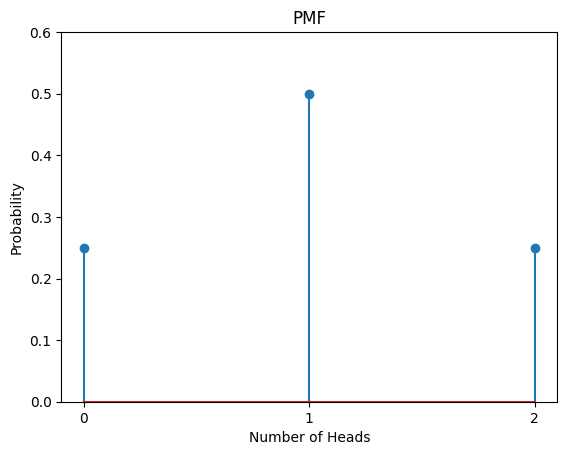      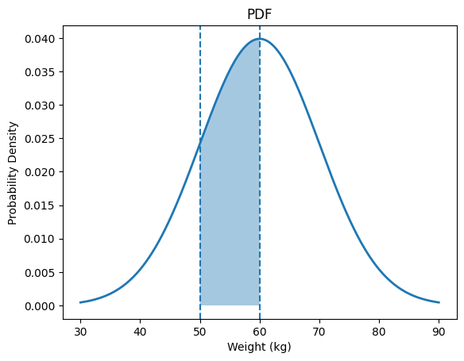

Can we see one important thing here? For PDF, we do not have probability along the y-axis, it is **probability density**. Because continuous values can take infinitely many values within an interval, we cannot find the probability at a point we must look for the density around it therefore we ended up taking **probability density** along y-axis. To find the probability we must find the shaded area under the graph. Taller part of the curve means - Values around this region are relatively more concentrated and lower part means - Values around this region are relatively less concentrated. 

We learned that a PMF tells us the probability of individual values for a discrete random variable, while a PDF helps us calculate probabilities over ranges for a continuous random variable. But what if we want to know the probability that a random variable is **less than or equal to a particular value?**

Here comes the **Cumulative Distribution Function**.
Mathematically: **F(x) = P(X ≤ x)**

For our classic example of *two coins* we already saw *P(X = 1) = 1/2*, *P(X = 2) = 1/4* and *P(X = 0) = 1/4*. What will be F(0), F(1) and F(2)?

F(0) = P(X ≤ 0) = 1/4 *(Here we do not have any variable less than 0 so we only added the probability of having 0)*,

F(1) = P(X ≤ 1) = 1/4 + 1/2 = 3/4 *(Here we have values 0 and 1 so we added the probability of having 1 as well as 0)*,

Similarly for F(2) = P(X ≤ 2) = 1/4 + 1/2 + 1/4 = 4/4 = 1 *(Here we have values 0,1 and 2 so we added the probability of having 2, 1 and 0)*.
  
                            PMF gives individual probabilities. CDF keeps adding them together.

The same goes for the PDF as well, the CDF represents the total area under the PDF curve from the left up to (x). So for our example if we say F(60) = P(X ≤ 60) we mean **What is the probability that a randomly selected student's weight is 60 kg or less?**

And that is why the **CDF works for both discrete and continuous random variables.**

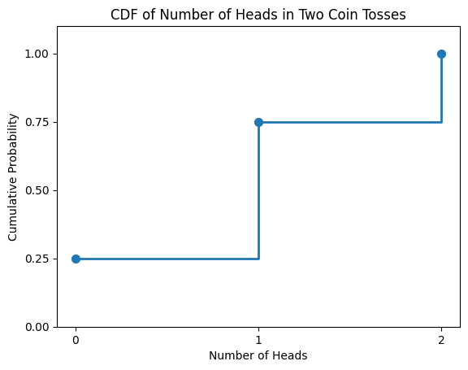      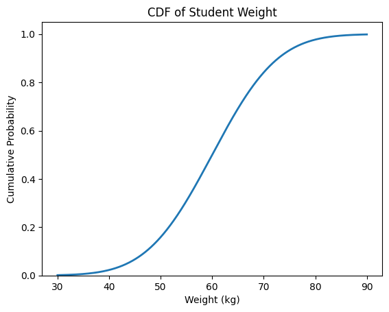

Here we can see how the cumulative probability reaches 1 in both cases.

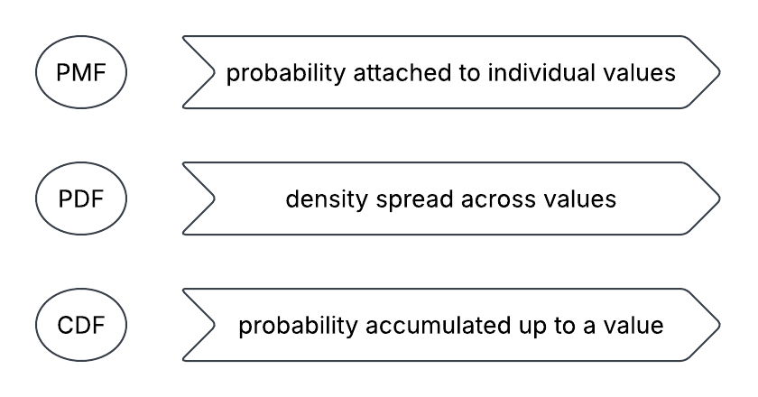

Here are the mathematical formulations to remember:

**Probability Mass Function (PMF)** :

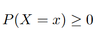

**Probability Density Function** :

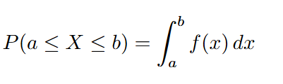

**Cumulative Distribution Function** :

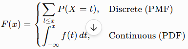

                                              DISCRETE
                                    PMF ── cumulative sum ──> CDF
                                    PMF <──── difference ───── CDF

                                             CONTINUOUS
                                    PDF ───── integration ───> CDF
                                    PDF <── differentiation ── CDF

## Practice Questions: ##

Q1. A data scientist is analyzing the number of customer support tickets raised by customers in one week.

The data collected from 30 customers is:

$$ 2,1,3,0,2,4,1,2,3,2, $$ $$ 1,0,2,5,3,2,1,4,2,3, $$ $$ 0,2,1,3,2,4,1,2,5,3 $$
Question:

Using this data:

- Calculate the Probability Mass Function (PMF) of the number of support tickets.
- Find the probability that a randomly selected customer raised:
   1. Exactly 2 tickets

   2. At most 2 tickets

   3. More than 3 tickets

--> X ∈ {0,1,2,3,4,5}

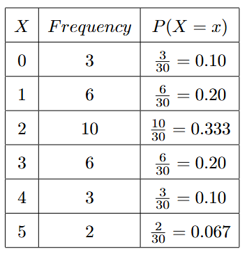

1. Exactly 2 tickets
P(X=2) = 0.333

So approximately 33.3% of customers raised exactly 2 tickets.

2. At most 2 tickets

"At most 2" means:

$$ X\leq2 $$

Therefore:

$$ P(X\leq2) = P(0)+P(1)+P(2) $$ $$ =0.10+0.20+0.333 $$ $$ {P(X\leq2)\approx0.633} $$
3. More than 3 tickets

"More than 3" means:

$$ X>3 $$

Therefore:

$$ P(X>3)=P(4)+P(5) $$ $$ =0.10+0.067 $$
P(X>3) ≈ 0.167

----

Q2. A company analyzes the time customers spend on its website. Let the continuous random variable \(X\) represent the time spent on the website (in minutes).

Suppose the probability density function is estimated as:

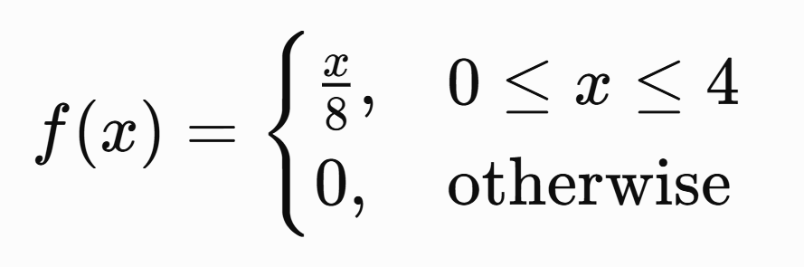
Questions:
   1. Verify whether this is a valid PDF.
   2. Find the probability that a randomly selected customer spends between 1 and 3 minutes on the website:
$$ P(1\leq X\leq3) $$
   3. Find the probability that a customer spends less than 2 minutes.
Find the probability that a customer spends more than 3 minutes.
What is the probability that a customer spends exactly 2 minutes?

--> 1. For a valid PDF:

$$ \int_{-\infty}^{\infty}f(x)\,dx=1 $$

Since the PDF is non-zero only from \(0\) to \(4\):

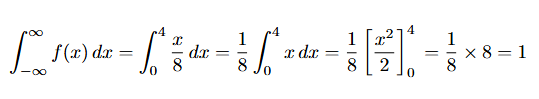

Therefore, this is a valid PDF.

2️. For a continuous variable, we calculate probability using the area under the curve:

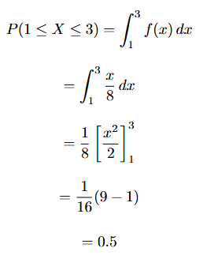

So there is a 50% probability that a customer spends between 1 and 3 minutes on the website.

3️. Probability of spending less than 2 minutes

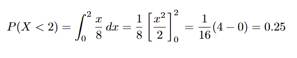

So there is a 25% probability that a customer spends less than 2 minutes on the website.

4️. Probability of spending more than 3 minutes

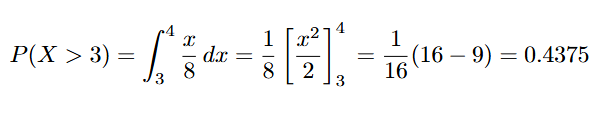

So there is a 43.75% probability that a customer spends more than 3 minutes on the website.

5️. Probability of exactly 2 minutes

**Here's the most important difference between PMF and PDF:**

$$ \boxed{P(X=2)=0} $$

Because \(X\) is a continuous random variable.

We calculate probabilities over an interval, not at a single point.
	​

----

Until now, we have learned about Probability, Random Variables, PMF, PDF, and CDF. At this point, you might be wondering: Why does a Data Scientist need to learn all of this?

The answer is simple: data is uncertain.

When we collect real-world data, we don't always know exactly what value will appear next. We can observe patterns, understand how values are distributed, and estimate how likely different outcomes are.

This is where probability becomes important.

PMF helps us understand probabilities associated with discrete values, while PDF helps us understand how continuous values are distributed. CDF helps us understand the probability of observing a value less than or equal to a particular point.

These concepts give us the mathematical foundation for understanding uncertainty and patterns in data.

And as we move further into Probability Distributions and eventually Machine Learning, you will see that these ideas don't disappear—they become the foundation on which many statistical and Machine Learning concepts are built.

So don't worry if the Machine Learning connection isn't completely visible yet. Right now, we are building the foundation. And just like we cannot build a house without its foundation, we cannot properly understand many Machine Learning concepts without understanding probability first.